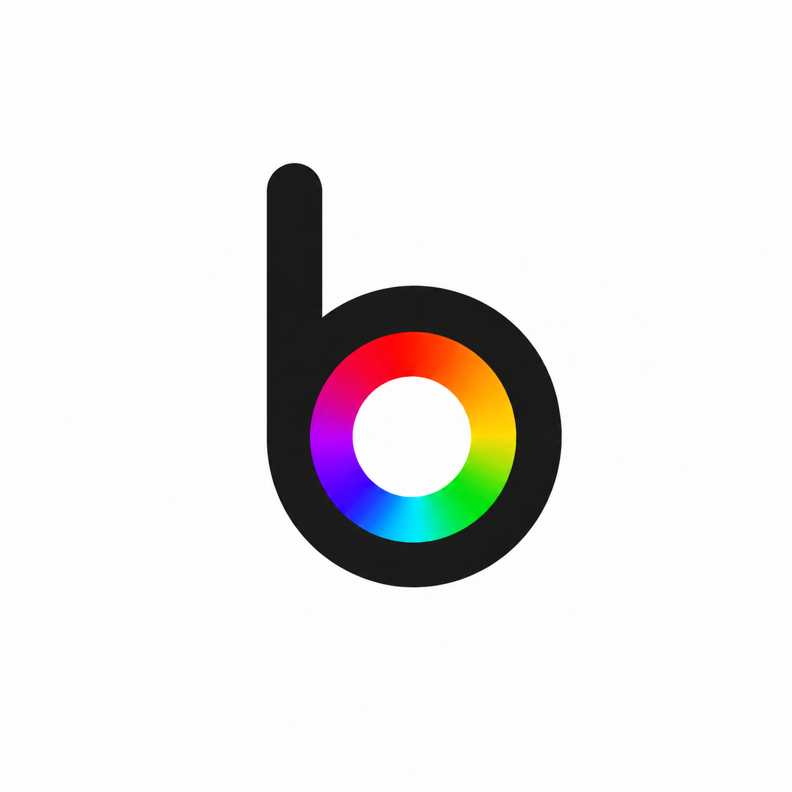
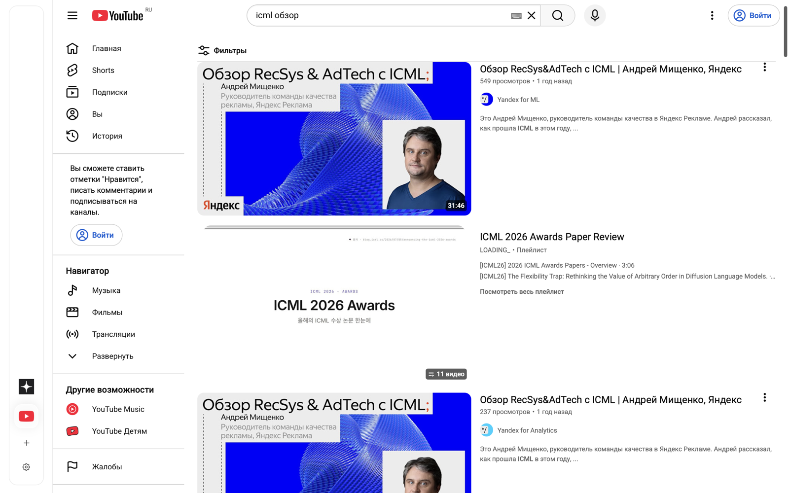

<p align="center">
  
</p>

<h1 align="center">Briviba</h1>

<p align="center">
  A native macOS browser with a glass sidebar, isolated site state, warm tabs, and a quiet WebKit surface.
</p>

<p align="center">
  
  
  
  
</p>

<p align="center">
  <a href="SPEC.md">Spec</a> |
  <a href="docs/ARCHITECTURE.md">Architecture</a> |
  <a href="docs/UI.md">UI Notes</a> |
  <a href="docs/CODING_RULES.md">Coding Rules</a>
</p>

---

<p align="center">
  
</p>

## Overview

Briviba is a macOS-only browser prototype built directly on AppKit and WebKit. The interface is intentionally small: page content owns the screen, while tabs and browser controls live in a translucent left sidebar.

The project experiments with browser chrome that feels native to macOS without copying Safari tab strips directly.

## Features

- Native macOS window built with AppKit and `WKWebView`.
- Glass-style left sidebar with favicon tabs, close-on-hover controls, and scrollable overflow.
- Drag files onto the sidebar plus button to open them in new tabs.
- Memory and disk favicon cache for faster tab rendering.
- Lazy session restore: only the active restored tab loads at startup.
- Warm tab switching: loaded inactive `WKWebView` instances stay alive instead of being destroyed on every tab change.
- Cross-site navigations reuse the active `WKWebView` instead of rebuilding the page process.
- Persistent normal-mode WebKit storage for logins, cookies, and site data between sessions.
- Secure Mode with non-persistent WebKit storage.
- Settings window with persisted privacy, default search engine options, cookie viewing, and storage cleanup.
- Default search engines: DuckDuckGo, Google, Bing, and Yandex.
- Context menu on sidebar tabs for Back, Forward, Reload, Edit Address, and Close Tab.
- SQLite-backed settings, history, bookmarks, and downloads.
- Safari-like WebKit user agent for better site compatibility.

## Build

```bash
cmake -S . -B build
cmake --build build
open -n build/Briviba.app
```

## Install Locally

```bash
cp -R build/Briviba.app /Applications/Briviba.app
open -n /Applications/Briviba.app
```

## Project Layout

```text
include/briviba/     Public C++ interfaces
src/                 AppKit, WebKit, and persistence implementation
resources/           App icon, logo, and plist template
docs/                Architecture, UI notes, and supporting assets
```

## Status

Briviba is an active prototype. The current focus is browser chrome polish, predictable fullscreen behavior, tab performance, and settings-backed browsing preferences.

## License

MIT. See [LICENSE](LICENSE).
